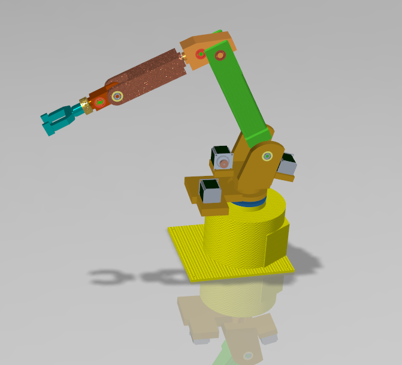
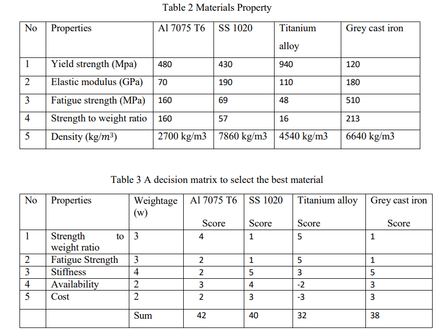

# 6-DOF-Robot-Arm

# 6-DoF Robotic Service Manipulator: Design & Kinematic Validation

**Tools:** PTC Creo Parametric 
**Domain:** Mechanical Design

## 1. Executive Summary
Designed to address the need for a high-payload, cost-effective service manipulator, this project delivers a fully validated mechanical architecture for a **6-Degree-of-Freedom (6-DoF)** robotic arm. The design prioritizes manufacturability and kinematic efficiency, utilizing a weighted decision matrix for material selection and rigorous static load analysis for actuator sizing.

**Key Engineering Achievements:**
* **Geometric Optimization:** Designed a kinematic chain capable of a **[Insert Reach, e.g., 850mm]** workspace radius while maintaining structural rigidity.
* **Component Selection:** Performed $L_{10}$ bearing life calculations and torque requirement analysis ($T = J \alpha + T_{static}$) to select NEMA 23/34 actuators with a 1.5x safety factor.
* **DFM (Design for Manufacturing):** Generated ISO-compliant technical drawings including geometric tolerancing (GD&T) and complete Bills of Materials (BOM).

---

## 2. Technical Documentation & Source Files

| Asset | Description | Format |
| :--- | :--- | :--- |
| **[3D Source Model](/cad/6dofrobotarm.stp)** | Full assembly export (AP214) compatible with SolidWorks, Catia, Fusion 360. | `.STP` |
| **[Exploded View & BOM](/drawings/Assembly_Exploded_View_BOM.pdf)** | Detailed assembly order, part numbers, and component hierarchy. | `.PDF` |
| **[Engineering Design Report](/docs/Mechanical_Design_Report.pdf)** | Comprehensive documentation covering math models, motor sizing, and stress analysis. | `.PDF` |

---

## 3. Engineering Logic & Validation

### Material Selection Strategy
A weighted decision matrix was implemented to select the optimal material for the arm links, balancing **Young's Modulus (Stiffness)** against **Density (Weight)** and **Cost**.

### Actuator Sizing & Transmission
Torque requirements were calculated based on the "worst-case" static hold position (fully extended horizontally). 
* **Transmission:** High-torque timing belts were selected for the base joints to isolate motor vibration.
* **Joint Design:** Deep groove ball bearings were arranged in pairs to handle radial and axial loads during dynamic movement.

---

## 4. How to View
1.  **3D Model:** Download the `6dofrobotarm.stp` file from the `/cad` folder and open it in any standard CAD viewer or Import it into SolidWorks/Creo.
2.  **Drawings:** View the `/drawings` folder directly in GitHub to see the manufacturing specifications.

---

*This project was developed as part of the M.Sc. Robotics & Automation curriculum at Warsaw University of Technology.*
